<p align="center">
  <a href="https://tappstracker.com">
    <picture>
      <source media="(prefers-color-scheme: dark)" srcset="docs/images/hero-dark.svg">
      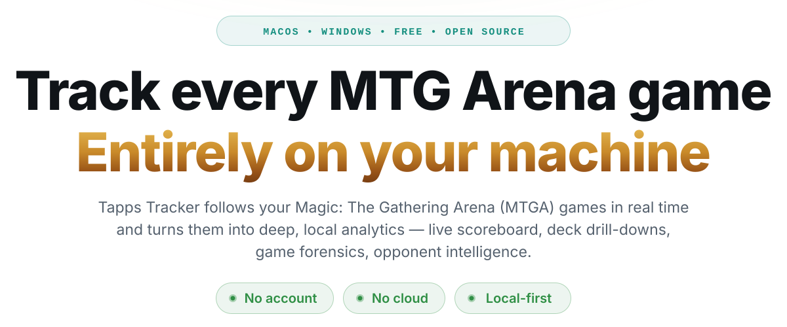
    </picture>
  </a>
</p>

<h3 align="center"><a href="https://tappstracker.com">tappstracker.com</a></h3>

<p align="center">
  Downloads for macOS and Windows, the full feature tour, and the changelog —
  free, open source, no account, no cloud.
</p>

<p align="center">
  <a href="../../releases"></a>
  
  
  <a href="https://discord.gg/ExfW3HaZgb"></a>
</p>

# Tapps Tracker

A real-time tracker that tails Arena's `Player.log`, a SQLite analytics store,
a full React dashboard, and an in-game overlay. No account, no cloud, no
uploads: your games, your data, your disk.

> 💬 **Join the community on [Discord](https://discord.gg/ExfW3HaZgb)** — for
> discussion, bug reports, and feature requests.

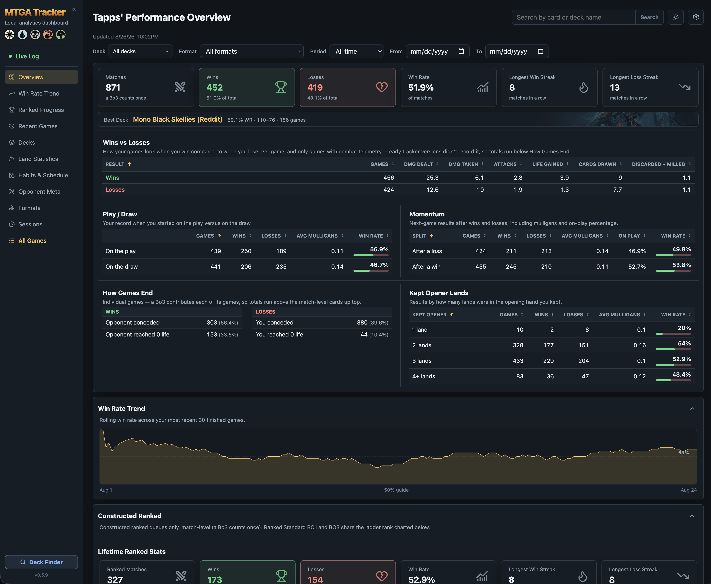

## What it does

**Live tracking.** One lightweight app — menu bar on macOS, system tray on
Windows — runs everything: it follows your game in real time (casts, draws,
lands, combat, life totals, stack resolution), writes every game to the local
analytics database, and serves the dashboard. The **Live Scoreboard** page
sits right in the dashboard: both players' life, colors, and deck, your record
with this deck and against this opponent (and, in Brawl, against their
commander), the turn clock, session record, today's games, and a play-by-play
feed that reads exactly like the per-game timeline — no separate window to
manage. Between games the previous game's final scoreboard stays up until the
next match starts.

**In-game overlay.** A slim rail docked beside Arena with the turn, the odds
your next draw is a land, and cards left in your library — opening into a
panel with your whole decklist and the chance of drawing each card next. On
from the first launch, in every game mode, and it reads only the tracker.

**Deck analytics.** Every deck gets a drill-down page tinted with its signature
card's art: per-game combat and resource averages for both players, turn-pace
and draw-quality summaries, card performance, mulligan results, decklist
version history with diffs, land statistics with flood/screw classification,
win & loss streaks, per-queue records (BO1/BO3, ranked/unranked, competitive
Brawl), Bo3 sideboarding records, and Best Against / Worst Against opponent
color highlights.

**Game forensics.** Each game page reconstructs the match: opening hand and
every mulligan (including the card you bottomed) for you — and how many times
your opponent mulliganed, which Arena reports for both seats — drawn cards
with the turn they arrived, draw-quality analysis with statistically-grounded
flood/screw detection (expected lands come from your actual decklist, not a
generic ratio), a life-total chart, per-seat combat summaries, and the
complete event timeline.

**Interaction analytics.** Every game records what both players did with their
interaction: removal and board wipes played (and how many you drew), creatures
lost to removal, counter magic — including how many counters actually landed
versus fizzled — bounce, land destruction with replacement rates, token
lifecycles, and poison. Cards are classified from their Arena rules text, and
a one-time backfill computes these stats for the games you tracked before the
feature existed.

**Opponent intelligence.** Revealed cards identify the opponent's colors, named
with community archetype names (Dimir, Jeskai, Mono-Red…), tracked across your
history so you can see which matchups actually beat you. An Opponents section
shows your most-faced opponents and your record by opponent color combination,
and the **All Opponents** page lists everyone you've ever been paired against
(a Bo3 counts once) with a per-opponent page behind each name. Optionally,
bring your own AI key (OpenAI, Anthropic, or Gemini) and the tracker names the
opponent's actual archetype — "Jeskai Control", "Gruul Aggro" — after each
game.

**Brawl, done properly.** Commanders are tracked from the command zone of
every Brawl game — yours and your opponent's. The Brawl section on the
Overview shows your overall and per-queue record (Historic Brawl, Brawl
(Ranked), Standard Brawl), **Best Commander** and **Toughest Opponent
Commander** boxes with card art, and **Your Commanders** / **Faced
Commanders** win-rate tables, because Brawl players think in commanders, not
deck names. Game pages open with a commander-vs-commander strip; deck pages
use the commander as the deck's signature art, keep it in the decklist and
Arena export, and list the opponent commanders you've faced with your record
against each. Recent Games rows expand to show the matchup with colors, and
the Live Scoreboard shows your lifetime record against the commander across
the table. Starting life and command-zone recasts are handled; Brawl is
recognized from Arena's match format, never from deck size.

**Deck Finder.** Browse current decklists from creators and sites (Moxfield,
AetherHub, TCGplayer, magic.gg, MTGO, Untapped) right inside the dashboard and
copy any list to your clipboard in Arena import format.

**The long game.** Match-level records (a Bo3 counts once, like the ladder
does), win-rate trends, How Games End with per-reason percentages — concedes,
damage, decking, poison, timeouts — Constructed Ranked lifetime and per-season
stats beside the rank chart, session habits and fatigue splits, format
breakdowns, and a database health audit that can repair its own
inconsistencies. Recorded timelines mean new tracker features retroactively
backfill your old games.

## In-game overlay

A small always-on-top window docked beside Arena, on from the first launch.
Turn it off (or back on) from **Settings → In-game overlay** or the
menu-bar icon.

### The rail

<table>
<tr>
<td>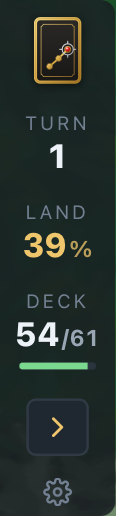</td>
<td>
What it shows at rest: the <b>turn</b>, the chance that your next <b>draw is a land</b>, and how much of your <b>deck</b> is left (the bar goes yellow once half the deck is gone, red under 15 cards).
<br><br>
The arrow opens the panel; the ⚙ opens the settings beside the rail.
</td>
</tr>
</table>

### The panel

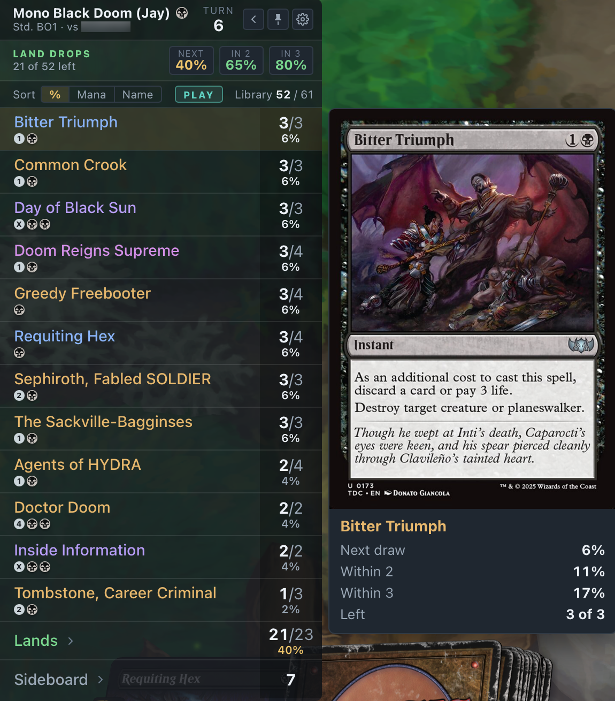

Your full decklist with copies left and the chance of drawing each card
next, land-drop odds for the next one, two and three draws, and a Play/Draw
pill. Sort by odds, mana value or name. Hover a row and the card appears
beside the panel with its next-draw, within-2 and within-3 odds. Lands fold
into one row, the sideboard is a row, and in Brawl the cards already drawn
collapse into a **Drawn** group. When the game ends the final library stays
up, marked **FINAL**, until you leave the results screen.

Pin the panel to keep it out, or leave it unpinned and the rail unfolds it on
hover and folds it back a few seconds after the cursor leaves. Scale,
opacity, dock side, max height, hotkeys (`Alt+Shift+T` / `⌥⇧T` toggles,
`Alt+Shift+H` / `⌥⇧H` hides) and a **Restore defaults** button live in its ⚙
menu. It appears only while Arena is running, on Arena's screen, and works
in every game — including the practice and event modes the tracker doesn't
save.

It reads only this tracker's local `GET /api/overlay` (card images come from
Scryfall), never Arena's memory or screen. **Arena in exclusive fullscreen
covers every overlay; use windowed or borderless.** It is a separate ~5 MB
native app (Tauri) shipped inside the tracker.

## Screenshots

**Live Scoreboard** — while you play: both life totals with color pips and
deck, your records with this deck and against this opponent, the turn and
game clock, your live session record, today's finished games, and a
play-by-play feed identical to the per-game timeline:

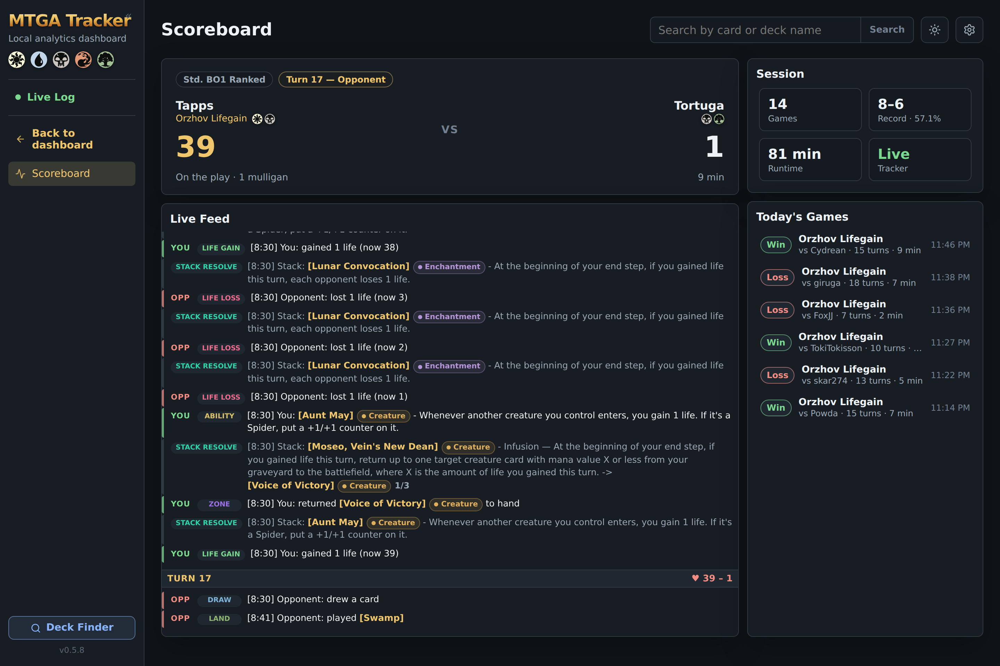

**Recent Games** — outcomes, deck and opponent colors (including the colorless
diamond), formats, Brawl commander matchups, draw status, and game pace at a
glance, with two-tier format pills (Standard, Historic, Limited, Brawl… and a
fly-out of queues) to narrow the table:

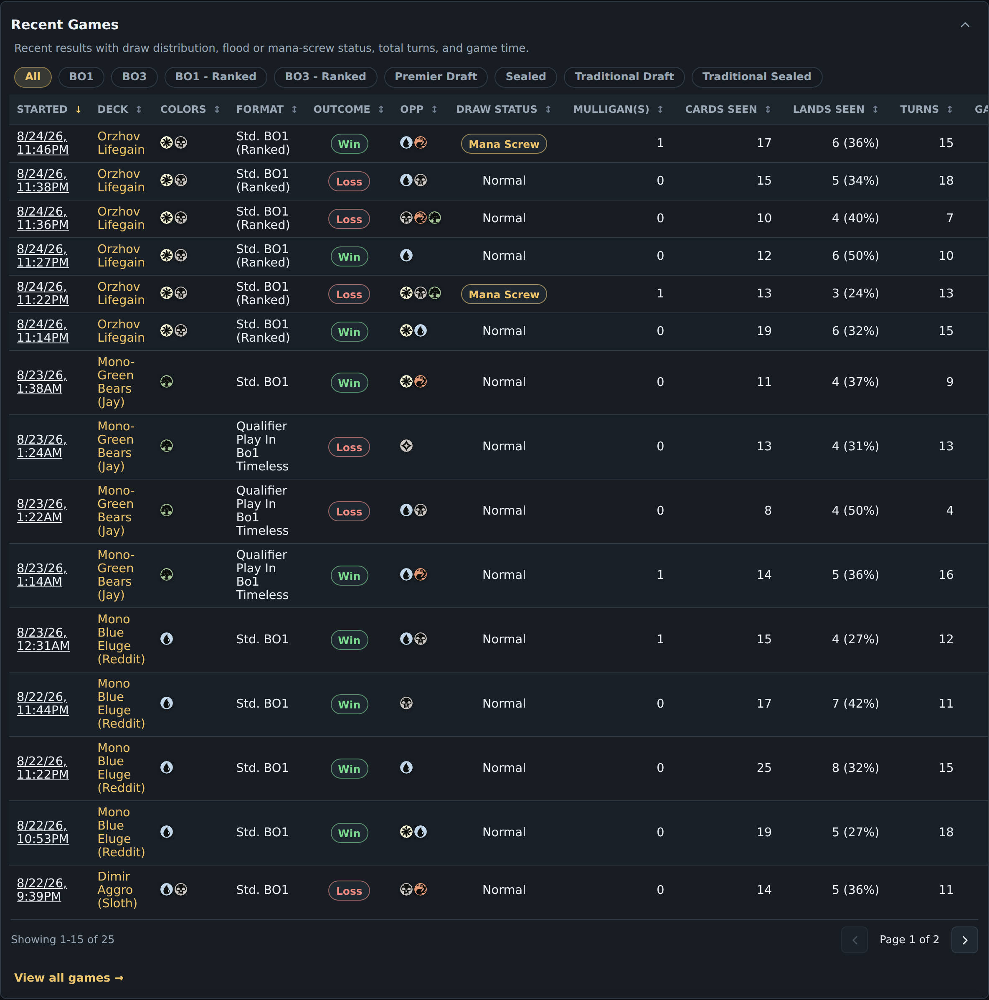

**Constructed Ranked** — lifetime and per-season match records around the ladder
chart, with a season selector to replay any climb:

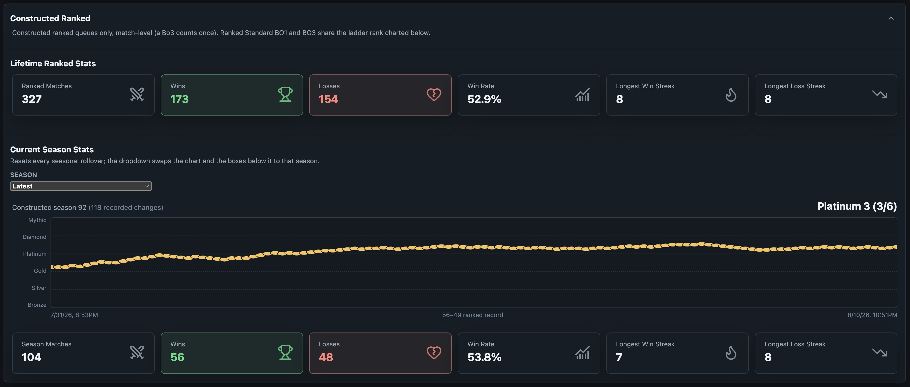

**Your decks** — every deck with its signature card, an Aggro/Midrange/Control
profile judged from damage pace, win-rate bars, and per-game combat telemetry,
searchable and sortable:

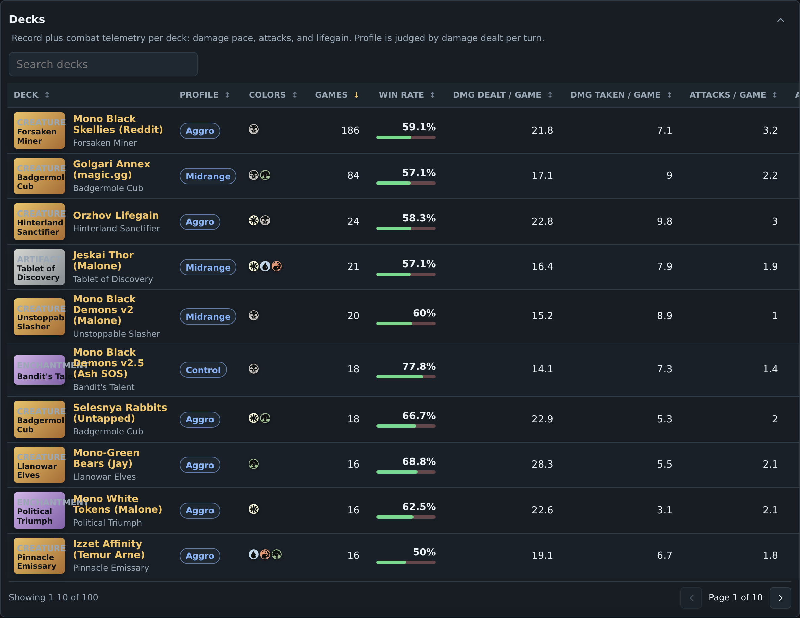

**Deck drill-down** — combat profile, streaks, decklist performance, land statistics:

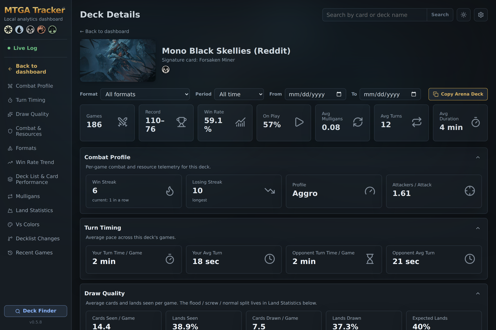

**Game forensics** — turn timing, draw quality, combat & resources, life chart, full timeline:

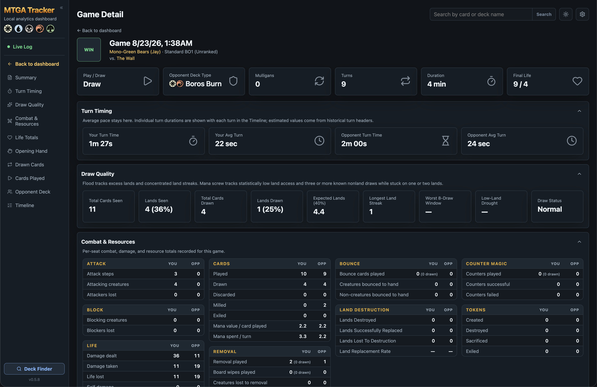

**All Opponents** — everyone you've been paired against, searchable, each
name opening a page with your full history against them:

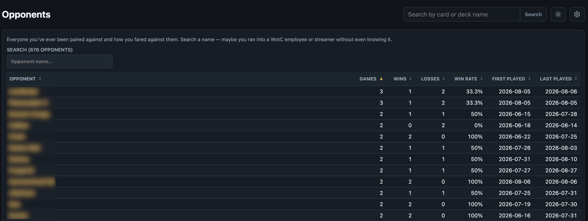

## Quick start

> [!CAUTION]
> **The tracker cannot see your games unless "Detailed Logs" is enabled in
> MTG Arena.** If everything looks fine but no games ever appear, this is
> almost always why. In Arena: gear icon (top right) → **Adjust Options** →
> **Account** → check **"Detailed Logs (Plugin Support)"** → restart Arena.
>
> 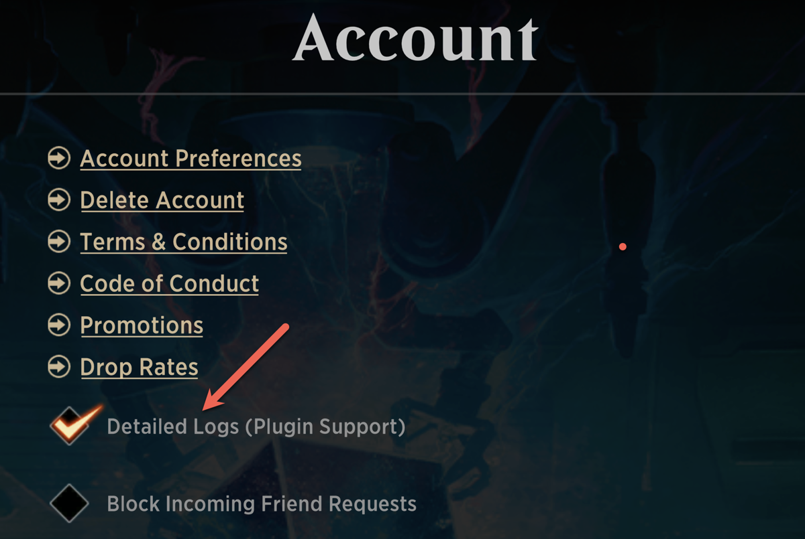

**Install the app:** grab the installer for your OS from
[tappstracker.com](https://tappstracker.com) or the
[Releases page](../../releases) — on Windows, `MTGA-Tracker-<version>-setup.exe`
gives you a Start Menu entry, an Apps & Features uninstaller, and in-place
upgrades (a portable `-windows.zip` is also published); on macOS, a
drag-to-Applications DMG. One install gets you everything: the tracker, the
dashboard, the in-game overlay, and the Deck Finder. The builds are unsigned,
so expect a one-time Gatekeeper / SmartScreen prompt —
[QUICKSTART.md](QUICKSTART.md) walks through it.

Then launch it, play a game, and open the dashboard from the menu-bar / tray
icon. Prefer to build it or run it from source? See
[Command-line tools](#command-line-tools) at the bottom.

## The dashboard

`mtga-tracker-app` serves it and opens it in your browser automatically.

| Route | What you get |
| --- | --- |
| `#/` | Overview: metrics, best deck, trends, ranked progress, recent games, decks, Brawl, opponents |
| `#/live` | Live Scoreboard: the current game, session record, today's games, play-by-play |
| `#/deck/<name>` | Deck drill-down: cards, mulligans, versions, land stats, streaks, vs-colors, commanders |
| `#/game/<id>` | Game detail: draw quality, life chart, hands, timeline, notes |
| `#/card/<name>` | Card drill-down: by-deck performance, repeat draws, opener impact |
| `#/games` | Every tracked game with deck picker, format pills, and period filter |
| `#/opponents` | Everyone you've been paired against; `#/opponent/<name>` for one opponent |
| `#/deckfinder` | Deck Finder: browse and export decklists from creators and sites |
| `#/settings` | In-game overlay, Deck AI, Deck Finder creators, collection export, tracker status |
| `#/audit` | Database health findings |

JSON API: `GET /api/snapshot`, `/api/live`, `/api/overlay`, `/api/deck`,
`/api/game`, `/api/card`, `/api/cards?q=`, `/api/games`, `/api/opponents`,
`/api/opponent`, `/api/version` — the dashboard is read-only except
`POST /api/game/annotation` (your per-game notes and tags) and the Settings
page's own `POST /api/settings/*`.

## Deck Finder

The Deck Finder lives **right inside the dashboard** — open it from the
"Deck Finder" button at the bottom of the sidebar or the menu bar entry. Pick
a site (AetherHub, magic.gg, Moxfield,
MTGO, TCGplayer, or untapped.gg) and a format, and it lists matching decks in a
table tuned to each site — win rates and matches for untapped.gg archetypes,
event placings for tournament sites, and so on. Open any deck to see its list,
then **Export to Arena** copies it in Arena's import format (or **Source**
opens the original page). "Surprise Me" pulls a random importable deck. Your
own featured creators for AetherHub, Moxfield, and TCGplayer are managed on the
**Settings** page (or in `deckfinder_config.json` at the top level of the
project folder). Everything it needs installs with the tracker; no separate
setup.

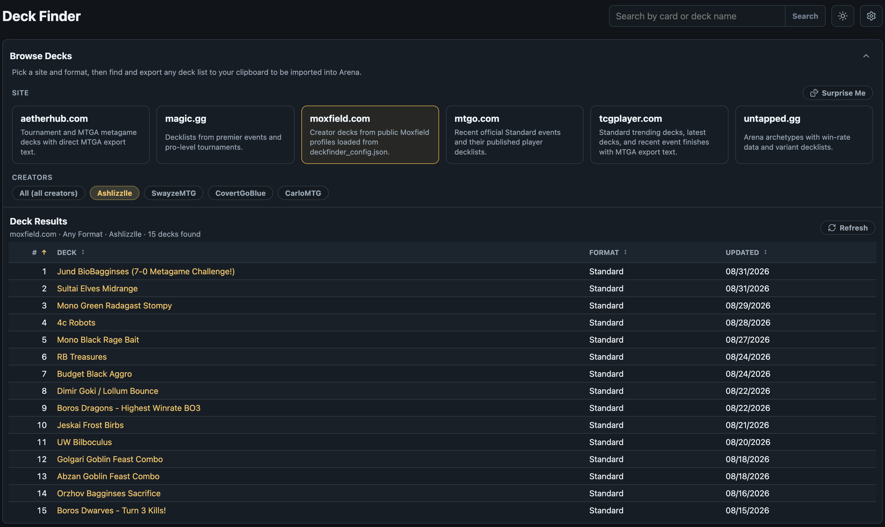

## Export your collection

Arena never exposes your card collection, so the Settings page can read it
straight out of the running game's memory and export it as `.json`, `.csv`,
`.txt`, or an Archidekt-format `.csv` — ready to import into
[Moxfield](https://moxfield.com), [Archidekt](https://archidekt.com), and
similar sites. Open Arena's Decks tab once so the collection is loaded, pick a
format, and the file downloads when the scan finishes (a copy also lands in
the tracker's data folder). On macOS an administrator prompt appears, since
reading another app's memory needs elevated access; the game itself is never
modified. Everything runs locally — no card database is downloaded and nothing
leaves your machine.

The **Archidekt export** adds a Scryfall ID column, which removes all
ambiguity about exactly which printing you own (Moxfield reads this format
too). IDs are resolved through Scryfall's batch API the first time — a few
seconds for a full collection — then cached locally, so later exports are
instant and offline; rows for cards too new to resolve still import by name
and set.

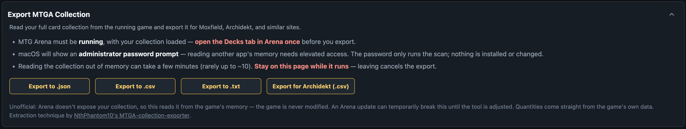

The memory-extraction technique is adapted from
[NthPhantom10](https://github.com/NthPhantom10)'s
[MTGA-collection-exporter](https://github.com/NthPhantom10/MTGA-collection-exporter)
— full credit to them for working out how to find the collection in Arena's
process memory.

## AI deck identification (optional)

With an API key, the tracker makes exactly one small request per completed
game and names the opponent's deck — the Game Detail page shows it as the
Opponent Deck Type, falling back to plain colors when there's no guess. The
call runs in the background after the game ends (and only when at least three
opponent cards were revealed), so tracking never waits on it.

What leaves your machine is only the names of the cards your opponent
revealed in that game — never your deck, your account, or your log. Nothing
else uses the key: the live scoreboard's colors come from Arena's local card
database, and its mid-game deck label is a local guess that reuses names
from earlier games.

Configure it on the dashboard's **Settings** page (gear icon, top right — or
the "Settings" menu-bar entry): enable, pick a provider (OpenAI, Anthropic, or
Gemini), paste your key, optionally set a model. The Settings page also holds
your Deck Finder creators, a tracker-status readout, and the Database Health
link. The choice is saved to `settings.json` at the top level of the project
folder (installed builds keep it in the app data folder), and your key is only
ever sent to the provider you chose. Without a key the feature simply stays off.

## What isn't tracked

Some game modes are intentionally excluded from your saved stats, because
mixing them into constructed analytics would skew win rates and draw math:

- **Jump In!** (`Jump_In_*` events)
- **Midweek Magic** (`MWM_*` events)
- **Momir** and similar novelty modes
- **Welcome Deck Duels** (pre-made deck vs pre-made deck)
- **Practice games against Sparky** (the Arena bot) — this includes bot
  Color Challenges; Starter Deck Duels against human opponents ARE tracked
- Games the tracker joined mid-way (no reliable opener/draw data)

These games still display live in the tracker window (with a note that
they won't be saved), and the in-game overlay works in them like in any
other game — a practice game has a library and draw odds too. Only the
history stays out: nothing from them lands in your stats.

## Data & privacy

Everything is local SQLite. Stored logs are scrubbed of tokens and personal
paths before persistence. The only network traffic is your browser fetching
Scryfall card art — plus, only when you open the bundled Deck Finder,
its requests to the public decklist sites you browse there — and, only if
you enable AI deck identification, exactly one small request per completed
game to the AI provider you configured, carrying only the names of the cards
your opponent revealed. Card
*identification* uses Arena's own local card database
(`Raw_CardDatabase_*.mtga`, discovered automatically under the Steam/Epic
install, override with `MTGA_DATA_DIR`).

Where things live:

- Arena log — `~/Library/Logs/Wizards Of The Coast/MTGA/Player.log` (macOS),
  `%USERPROFILE%\AppData\LocalLow\Wizards Of The Coast\MTGA\Player.log` (Windows)
- Source runs — `data/mtga_tracker.sqlite3`, with `settings.json` and
  `deckfinder_config.json` at the top level of the project folder
- Installed builds — `~/Library/Application Support/MTGA Tracker` (macOS),
  `%LOCALAPPDATA%\MTGA Tracker` (Windows), fully independent of the repo

Don't run the source and installed trackers at the same time, and never copy a
live database while a tracker owns it — use SQLite's backup API for migrations.

## Command-line tools

Everything above runs from the menu-bar / tray app; all of it is also
available from a terminal.

**Run from source:**

```bash
python3 -m venv venv && source venv/bin/activate
pip install -e '.[dev,gui]'
mtga-tracker-app        # tracker + dashboard (with the Live Scoreboard), one command
```

| Command | Purpose |
| --- | --- |
| `mtga-tracker-app` | Menu-bar / tray app: tracker + dashboard + overlay |
| `mtga-tracker-app --no-gui` | Tracker + dashboard in one terminal, no menu bar |
| `mtga-tracker` | Console tracker only |
| `python -m mtga_tracker.dashboard` | Dashboard only (`http://127.0.0.1:8765`; build `ui/` first: `cd ui && npm install && npm run build`) |
| `python -m mtga_deck_downloader` | The Deck Finder as a terminal UI (installed builds: `MTGA Tracker --deck-finder`) |
| `python -m mtga_tracker.db_audit [--repair]` | Database consistency audit / safe self-repair |
| `python -m mtga_tracker.draw_quality --card "Llanowar Elves"` | Draw-quality & flood/screw report |
| `python -m mtga_tracker.payload_dump <game_id>` | Print a game's archived raw payloads as JSON |

Port busy? `--port 8766`. Lost the terminal? `lsof -ti tcp:8765 | xargs kill`.

Ready-made SQL reports live in [`data/_queries/`](data/_queries/README.md):

```bash
sqlite3 data/mtga_tracker.sqlite3 < data/_queries/WinRateByDeck.sql
```

**Build the installers yourself:**

```bash
# macOS app / DMG
scripts/build_macos_app.sh          # dist/MTGA Tracker.app
scripts/build_macos_installer.sh    # dist/MTGA-Tracker.dmg
```

```powershell
# Windows exe / zip / setup.exe
powershell -ExecutionPolicy Bypass -File scripts\build_windows_app.ps1
```

Both include the in-game overlay, which needs Rust
(`scripts/build_overlay.sh` / `.ps1` build it on its own).

## Development

```bash
pip install -e '.[dev,gui]'

# Python suite (menu app tests need a display)
venv/bin/python -m pytest tests -q --ignore=tests/test_menu_app.py \
  --deselect "tests/test_log_parser.py::test_find_log_path_error_handling"

# Frontend: tests, types, lint, build (dashboard serves ui/dist — rebuild after UI changes)
cd ui && npx vitest run && npx tsc -b && npm run lint && npm run build

# UI development with hot reload (API + Vite side by side)
venv/bin/python -m mtga_tracker.dashboard
cd ui && npm run dev
```

Layout: `src/mtga_tracker/` (tracker mixins, analytics store, dashboard
server), `ui/` (React/TypeScript dashboard), `tests/`, `packaging/` + `scripts/`
(PyInstaller builds), `docs/`. Working on it with an AI agent? Start with
[AGENTS.md](AGENTS.md) — it's kept current on purpose, and it's the only place agent
guidance lives.

## Documentation

- [QUICKSTART.md](QUICKSTART.md) — install and first run
- [docs/plans/RELEASE_PLAN.md](docs/plans/RELEASE_PLAN.md) — packaging, GitHub Releases, alpha checklist
- [docs/plans/OVERLAY_TRACKER_PLAN.md](docs/plans/OVERLAY_TRACKER_PLAN.md) — the in-game overlay's design plan (Tauri v2), with the original mockups
- [docs/MTGA_LOG_FORMAT.md](docs/MTGA_LOG_FORMAT.md) — how Arena's log actually works
- [docs/plans/MTGA_INSTALL_DISCOVERY.md](docs/plans/MTGA_INSTALL_DISCOVERY.md) — plan for finding Arena's card DB in standalone/non-default installs
- [docs/plans/SCRY_TRACKING.md](docs/plans/SCRY_TRACKING.md) — plan for scry/surveil stats on the game and deck pages and the Live Scoreboard (the overlay stays out of it)
- [docs/plans/linux_implementation.md](docs/plans/linux_implementation.md) — plan for Linux support (Arena under Steam/Proton or Wine), phased so CI verifies it before a Linux desktop exists
- [CHANGELOG.md](CHANGELOG.md) — what changed in each release

## License

Copyright (C) 2026 Travis Patton

Licensed under the GNU Affero General Public License v3.0 or later
(AGPL-3.0-or-later) — see [LICENSE](LICENSE). You may use, modify, and
redistribute this software, but any distributed or network-hosted derivative
must also publish its source under the same license. For commercial licensing
outside these terms, contact the author.

*Tapps Tracker is unofficial Fan Content. Not approved/endorsed by Wizards of
the Coast. Magic: The Gathering and its logos are trademarks of Wizards of the
Coast LLC.*
