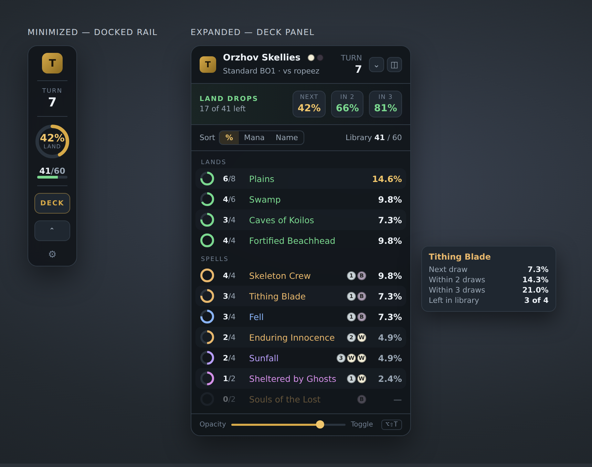

# In-Game Overlay Plan — Tauri v2

Goal: a small always-on-top overlay beside Arena that answers two questions
without leaving the game — **what's my chance of drawing a land next?**
(minimized) and **what's left in my library and how likely is each card?**
(expanded). Transparency slider, drag anywhere, one hotkey to toggle, and the
land odds visible even when minimized.

This replaces the earlier PyQt6 plan. The reasons for the change are in §2.



## 1. What it shows

### Minimized — the rail

A 72px-wide vertical rail meant to sit against a screen edge, in the order a
player reads it mid-game:

| Slot | Content | Why |
| --- | --- | --- |
| Mark | Tapps "T" tile | identifies the window; drag handle |
| Turn | current turn number | orientation at a glance |
| **Land ring** | ring gauge filled to the next-draw land chance, "42% LAND" inside | the one number the minimized state exists for |
| Library | `41/60` with a thin bar (library ÷ deck size) | how deep into the deck you are |
| DECK | opens the expanded panel | primary action, gold |
| ⌃ | collapse to the mark only (a 30px tile) when you want it out of the way | |
| ⚙ | opacity, dock side, hotkey, quit | |

The ring turns from gold to the danger tone when the land chance falls below
25% with fewer than four lands in play (you're screwed and the deck isn't
going to fix it) — the one piece of colour-as-warning in the design.

### Expanded — the deck panel

320px wide, height follows the list (capped to the screen; the list scrolls).

- **Header**: deck name with colour pips, format and opponent name, turn,
  and two controls: collapse (back to the rail) and pin (click-through mode,
  see §4).
- **Land drops strip**: `17 of 41 left` plus three odds — **NEXT** (gold),
  **IN 2**, **IN 3** (green). The rail's ring is the NEXT number; the strip is
  its full expansion.
- **Sort + library**: sort by %, mana value, or name; `Library 41 / 60`.
- **Card list**, grouped Lands then Spells. Each row: a ring showing copies
  left ÷ copies in deck (coloured by card type — land green, creature amber,
  instant blue, sorcery violet, enchantment pink, artifact grey; the same
  type palette the dashboard's type chips use), `left/total`, name in the
  type colour, mana cost from the bundled mana font, and the next-draw %.
  Percentages step through three weights (gold ≥ 10%, white ≥ 5%, muted
  below) so the eye finds the live outs first. Rows at 0 copies dim to 38%
  and show a dash — they stay in place so the list never reshuffles under
  you.
- **Hover card** (also long-press on a touch display): next draw, within 2,
  within 3, and copies left — the hypergeometric detail without cluttering
  the row.
- **Footer**: opacity slider (0.3–1.0, live), and the toggle hotkey shown so
  people learn it.

What it deliberately does not have: a play-by-play log. The dashboard's Live
Scoreboard already owns that; the overlay stays a draw-odds instrument.

### Math (all hypergeometric, all already in `draw_quality.py`)

- next draw for card X = `copies_left / library_size`
- land next draw = `lands_left / library_size`
- within N draws = `1 − C(library − copies, N) / C(library, N)`
  (`hypergeom_tail_at_least(…, 1)`)

Library size is the tracker's live count of the player's library zone, not
`deck_size − cards_seen` — mills, tutors, and "put on the bottom" all change
the library without a draw. When the tracker knows a card is on top of the
library (a scry or surveil that kept it, a tutor to top), the next-draw odds
for that card show 100% and everything else 0% for that draw, with a small
"top: <card>" line in the land strip; if the tracker does not know, it says
nothing rather than guessing.

## 2. Why Tauri v2

The earlier plan put the overlay in the PyQt6 process because it was already
there. That has three problems Tauri solves outright:

- **Always-on-top over a game on both OSes.** Tauri windows are native
  (`NSPanel`-style behaviour on macOS via `tauri-nspanel`, layered topmost
  windows on Windows) with `always_on_top`, `transparent`, `decorations:
  false`, `skip_taskbar`, and `set_ignore_cursor_events` (click-through) as
  first-class window options. Getting the same from Qt means platform
  `#ifdef` work we would maintain forever.
- **Same UI code as the dashboard.** The overlay is a React + TypeScript
  view; it reuses `ColorPips`, `ManaCost`, the type palette, and the design
  tokens from `ui/`. No second rendering stack to keep visually in sync.
- **A small, signed, separate binary.** A Tauri app is ~6–10 MB and runs in
  its own process, so an overlay crash can never take tracking down (the one
  invariant this project cares about most). It is also the natural shape for
  a future standalone distribution.

Tauri v2 specifically (not v1): stable plugin system (`window-state`,
`global-shortcut`, `autostart`, `single-instance`), the capability/permission
model for the webview, and current WebView2 / WKWebView support.

## 3. Architecture

```
┌──────────────────────────────┐        HTTP (127.0.0.1:8765)        ┌────────────────────────────┐
│ Tapps Tracker (Python)       │  GET /api/overlay  (poll 500 ms)    │ Tapps Overlay (Tauri v2)   │
│  tracker thread ─► SQLite    │ ◄────────────────────────────────── │  Rust core: windows, tray,  │
│  live_status.overlay_json    │                                     │   hotkey, click-through     │
│  dashboard HTTP server       │ ──────────────────────────────────► │  Webview: React panel/rail  │
└──────────────────────────────┘        JSON overlay state           └────────────────────────────┘
```

- **The Python tracker stays the only thing that reads Arena's log.** It
  already maintains the submitted decklist (`game_deck_cards` machinery),
  every zone transfer out of the library, library size, and game lifecycle.
  A new pure module `overlay_state.py` builds the state: a multiset
  subtraction of "left the library" from "submitted deck", plus library
  size, lands left, known-top cards, `game_active`, `mid_game_attach`.
- **Publishing**: the tracker writes the state as JSON to a new
  `live_status.overlay_json` column on every library-touching event (same
  pattern as `last_game_json`). `live_api.py` serves it at `GET /api/overlay`
  with an `ETag` so the 500 ms poll is a 304 almost all the time. No sockets,
  no files, no IPC beyond the HTTP server we already run. (SSE can replace
  polling later without changing the state shape.)
- **The Tauri app** is one window that switches between rail and panel
  layouts (resizing itself), not two windows — position and opacity carry
  over, and there is only one thing to drag. Rust side: window creation and
  flags, tray item, global hotkey, `window-state` persistence, single
  instance, and a tiny `overlay://` command surface (`set_opacity`,
  `set_click_through`, `set_layout`). Everything else is TypeScript.
- **Settings** live in Tauri's app data (`overlay.json`: opacity, layout,
  dock side, hotkey, position via `window-state`). The tracker's own
  `settings.json` gets one flag, `overlay.autolaunch`, read by the menu-bar
  app.
- **Launch**: the menu-bar app gains **Show Overlay**, which starts the
  Tauri binary the way `deck_downloader_launcher.py` starts the Deck Finder
  (bundled inside the app on both OSes; PyInstaller `datas`), passing
  `--api http://127.0.0.1:<port>`. The overlay also runs on its own — it
  simply shows "Tracker not running" until the API answers.

## 4. Window behaviour

- `always_on_top: true`, `decorations: false`, `transparent: true`,
  `shadow: false` (we draw our own), `skip_taskbar: true`, `resizable: false`,
  `focus: false` at creation so it never steals focus from Arena.
- **Drag**: the header/mark is a `data-tauri-drag-region`. Position persists
  through the `window-state` plugin; on launch the window is clamped back on
  screen if the monitor layout changed.
- **Click-through ("pin")**: `set_ignore_cursor_events(true)` makes the panel
  purely visual so misclicks reach Arena; the hotkey or tray un-pins. The
  pin control shows a filled icon while active.
- **Hotkey**: `Alt+Shift+T` toggles rail ↔ panel; `Alt+Shift+H` hides/shows.
  Both rebindable in ⚙. Registered through `global-shortcut`, released on
  exit.
- **macOS**: over Arena in windowed and fullscreen-windowed modes. Over true
  exclusive fullscreen the game owns its own Space and no overlay (ours,
  untapped.gg's, anyone's) can float there — documented in the README, and
  the overlay detects the case (window not visible while a game is active)
  and shows a one-time hint in the tray. `tauri-nspanel` gives the
  non-activating panel behaviour and `collectionBehavior` for staying on
  the game's Space in fullscreen-windowed mode.
- **Windows**: topmost layered window; WebView2 is present on Windows 10/11.
  Arena's borderless-fullscreen mode is fine; exclusive fullscreen has the
  same limitation as macOS.

## 5. Lifecycle

- Appears (rail) when a deck is submitted; the tracker sets
  `game_active: true`. Rail updates per event; the panel re-sorts only when
  the sort key changes or a row's count changes, never on every poll.
- Bo3: each game submits a fresh decklist, so sideboarding is free.
- Game end: the rail keeps the final state for 8 seconds, then shows
  "Waiting for next match" with the last deck name — the same idea as the
  scoreboard's frozen previous game, without the numbers.
- Mid-game attach: the tracker cannot know the library, so the rail shows
  "joined mid-game" and the panel is unavailable. Never show numbers the
  tracker can't stand behind.
- Brawl: the commander is in the command zone, not the library; it is
  excluded from the multiset and the library is 99. Recasts from the command
  zone never touch the library.
- Tracker stops or the API goes away: the overlay greys out with "Tracker
  not running" and keeps polling every 2 s.

## 6. Repository layout

```
overlay/                     Tauri v2 project (new)
  src-tauri/                 Rust: main.rs, tray, shortcuts, window commands, tauri.conf.json
  src/                       React + TS: Rail.tsx, Panel.tsx, CardRow.tsx, useOverlayState.ts
  package.json               vite + @tauri-apps/api + @tauri-apps/cli
ui/src/shared/               design tokens, ColorPips, ManaCost, type palette, hypergeometric helpers (moved here; the dashboard imports from it too)
src/mtga_tracker/overlay_state.py   pure state builder (no Qt, no Tauri)
src/mtga_tracker/live_api.py        + GET /api/overlay
```

Build: `cd overlay && npm run tauri build` produces the platform binary;
`scripts/build_macos_app.sh` / `build_windows_app.ps1` copy it into the
bundle. CI adds a Rust toolchain step to `release.yml` (cached).

## 7. Build order

1. **Phase 1 — state + API (Python, fully tested).** `overlay_state.py`
   (multiset, library size, lands left, known-top, flags) with unit tests
   built from minimal payloads; `live_status.overlay_json`; `GET
   /api/overlay` with ETag. The dashboard could render this too, which is
   how it gets verified before any Tauri code exists.
2. **Phase 2 — Tauri shell.** Window flags, drag, tray, hotkey,
   window-state, single instance, opacity command. Static JSON fixture in
   the webview.
3. **Phase 3 — rail + panel UI** against the fixture, then against the live
   API: land ring, land strip, list, hover card, sort, dimmed rows,
   waiting/offline/mid-game states.
4. **Phase 4 — integration.** Menu-bar "Show Overlay", bundling in both
   installers, `overlay.autolaunch`, README section (with the fullscreen
   caveat), CHANGELOG entry.
5. **Phase 5 — polish.** Known-top cards, danger-tone ring, light theme,
   dock-side snapping, rebindable hotkeys.

## 8. Risks and answers

| Risk | Answer |
| --- | --- |
| Arena exclusive fullscreen hides every overlay | Document; detect and hint once; most players run borderless anyway |
| Two processes to ship and sign | Tauri produces one binary per OS; it goes inside the existing bundle; the existing signing step covers it (ad-hoc on macOS today) |
| Rust toolchain in CI | `dtolnay/rust-toolchain` + cache; ~3 min cold, seconds warm |
| Poll latency | 500 ms is under one animation frame of Arena's draw; SSE later if wanted |
| Library size drift (mills, tutors, bottom) | tracker's zone count is the source, not a subtraction; `db_audit` gains an overlay-state check |
| Wrong numbers are worse than no numbers | every state carries `confidence`; rail shows a dash for anything below `known` |

## 9. Not in scope

Opponent library odds (hidden information), a play-by-play feed (the Live
Scoreboard has it), card images in the overlay (hover in the dashboard has
them; the overlay must stay small and quick), and any network access from
the overlay other than the local tracker API.
